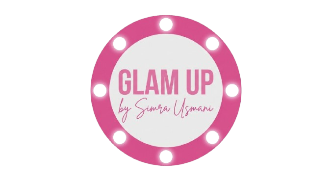
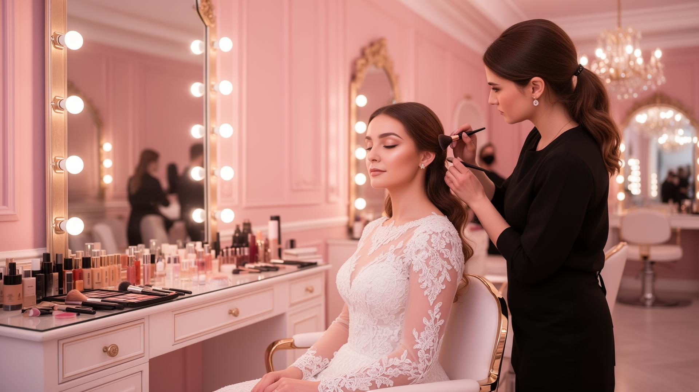

<div align="center">
  
  
  # Glam Up Makeup Studio
  
  ### Premium Bridal & Makeup Services in Karachi
  
  *by Simra Usmani*
  
  [](https://makeupstudi0.netlify.app/)
  [](https://www.linkedin.com/in/muzammil-ahmed-0902612a5/)
  
</div>

---

## 📖 About

**Glam Up Makeup Studio** is a premium beauty and makeup studio located in Karachi, Pakistan. Founded and operated by professional makeup artist **Simra Usmani**, we specialize in bridal makeup, hair styling, facials, and party makeup services.

This website showcases our services, portfolio, and provides an easy way for clients to book appointments and get in touch with us.

---

## ✨ Features

- 🎨 **Modern & Responsive Design** - Fully responsive across all devices (mobile, tablet, desktop)
- 🖼️ **Interactive Gallery** - Showcase of our best work and transformations
- 💅 **Service Showcase** - Detailed information about bridal, hair, makeup, and skincare services
- 💰 **Transparent Pricing** - Clear pricing packages for all services
- 📱 **WhatsApp Integration** - Direct booking through WhatsApp
- 🎭 **Smooth Animations** - Beautiful animations using Framer Motion
- 🔍 **SEO Optimized** - Proper meta tags and Open Graph for social sharing
- ⚡ **Fast Performance** - Built with Vite for lightning-fast load times

---

## 🛠️ Tech Stack

- **Frontend Framework:** React 18 with TypeScript
- **Build Tool:** Vite
- **Styling:** Tailwind CSS
- **Animations:** Framer Motion
- **Icons:** Lucide React
- **UI Components:** Radix UI
- **Deployment:** Netlify

---

## 🚀 Getting Started

### Prerequisites

- Node.js (v18 or higher)
- npm or yarn or bun

### Installation

1. Clone the repository
```bash
git clone https://github.com/yourusername/glam-up-studio-website.git
cd glam-up-studio-website
```

2. Install dependencies
```bash
npm install
# or
yarn install
# or
bun install
```

3. Start the development server
```bash
npm run dev
# or
yarn dev
# or
bun dev
```

4. Open your browser and visit `http://localhost:5173`

---

## 📦 Build for Production

```bash
npm run build
# or
yarn build
# or
bun run build
```

The production-ready files will be in the `dist` folder.

---

## 📱 Services Offered

- 💍 **Bridal Makeup** - Complete bridal packages with hair and makeup
- 💇 **Hair Styling** - Professional hair styling for all occasions
- 🧖 **Facial & Skincare** - Premium facial treatments
- 💅 **Nails & Mehndi** - Nail art and traditional mehndi services
- 🎉 **Party Makeup** - Glamorous looks for parties and events

---

## 📸 Screenshots

<div align="center">
  
  <p><em>Hero Section</em></p>
</div>

---

## 📞 Contact

- **Phone:** 0335-9767499
- **WhatsApp:** [Book Now](https://wa.me/923359767499)
- **Location:** Karachi, Pakistan

---

## 👨‍💻 Developer

<div align="center">
  
  
  ### Muzammil Ahmed
  
  Full Stack Developer
  
  [](https://www.linkedin.com/in/muzammil-ahmed-0902612a5/)
  [](https://github.com/yourusername)
  
</div>

---

## 📄 License

This project is developed for **Glam Up Makeup Studio** by Simra Usmani.

---

## 🙏 Acknowledgments

- Design inspiration from modern beauty and salon websites
- Images and content provided by Glam Up Makeup Studio
- Built with ❤️ for the beauty industry

---

<div align="center">
  
  ### ⭐ If you like this project, please give it a star!
  
  Made with 💄 by [Muzammil Ahmed](https://www.linkedin.com/in/muzammil-ahmed-0902612a5/)
  
</div>
